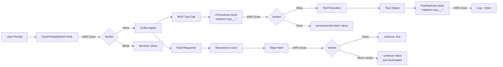

# Prisma AIRS Codex Hooks

**Real-time AI security scanning for the Codex CLI**

[](https://www.npmjs.com/package/@cdot65/prisma-airs-codex-hooks)
[](https://github.com/cdot65/prisma-airs-codex-hooks/actions/workflows/ci.yml)
[](https://opensource.org/licenses/MIT)
[](https://nodejs.org/)

---

Prisma AIRS Codex Hooks scans prompts, MCP tool traffic, and final responses in the [Codex CLI](https://developers.openai.com/codex) in real-time via the [Prisma AI Runtime Security (AIRS)](https://www.paloaltonetworks.com/prisma/ai-runtime-security) Sync API. **Blocks** prompts and MCP tool calls before they execute, and **audits** tool outputs and final responses for prompt injections, malicious code, sensitive data leakage, toxic content, and policy violations.

---

## Install

```bash
npm install -g @cdot65/prisma-airs-codex-hooks
```

---

## How It Works



:::warning[PostToolUse and Stop fire after the fact]
`PostToolUse` fires after the MCP tool already executed (this project runs it observe-only by policy), and `Stop` fires after the response has already streamed to the user. `Stop` terminates the turn on an AIRS block verdict so the session doesn't keep building on flagged content, but it cannot retract what was displayed. See [Codex Hooks API](reference/codex-hooks-api#codex-limitation-no-streaming-interception).
:::

:::note[Bash and file edits are not scanned]
By design, this project scans **MCP tools only** (`mcp__.*` matchers). Local Bash commands and `apply_patch` file edits are not sent to AIRS.
:::

---

## Capabilities

### 🛡️ Prompt Scanning

Scans every prompt before Codex processes it. Detects prompt injection, DLP violations, toxicity, and custom topic policy violations.

→ [Detection Services](features/detection-services)

### 🧩 Response & Code Auditing

Parses the final assistant message to extract code blocks separately. Natural language and code are scanned independently; an AIRS block verdict terminates the turn (post-stream).

→ [Code Extraction](features/code-extraction)

### 🔧 MCP Tool Scanning

Scans MCP tool inputs before execution (`PreToolUse`, can deny) and tool outputs after execution (`PostToolUse`, observe-only by policy). Both sent to AIRS as `tool_event` content.

→ [Architecture](architecture/scanning-flow)

### 🔒 Enforce or Observe

Three modes: `observe` (log only), `enforce` (block on detection), `bypass` (skip). Plus `fail_mode` to choose fail-open or fail-closed behavior on errors.

→ [Configuration](reference/configuration)

### ⚡ Fail-Open by Default

Never blocks the developer on infrastructure failures unless you opt into `fail_mode: "closed"`. Circuit breaker pattern bypasses scanning after consecutive API failures with automatic recovery.

→ [Circuit Breaker](features/circuit-breaker)

### 📦 Self-Contained Bundles

Each hook ships as a single minified ~125KB `.mjs` bundle that runs with plain `node` — no `node_modules` at runtime, fast startup.

→ [Installation](getting-started/installation)

---

## Get Started

| | |
|---|---|
| **Install** | Install from npm, set environment variables, and register hooks in Codex. → [Installation](getting-started/installation) |
| **Quick Start** | Get scanning in under 5 minutes. → [Quick Start](getting-started/quick-start) |
| **Configure** | Modes, fail mode, enforcement actions, profiles, circuit breaker, and logging. → [Configuration](getting-started/configuration) |
| **Architecture** | Scanning flow, module design, and key decisions. → [Architecture](architecture/overview) |
