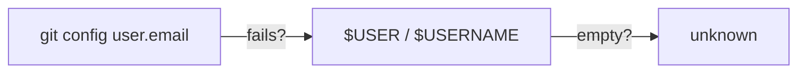

# Environment Variables

## Required

| Variable | Description |
|----------|-------------|
| `PRISMA_AIRS_API_KEY` | Prisma AIRS API key (`x-pan-token`). Used for authentication. |

## Optional

| Variable | Default | Description |
|----------|---------|-------------|
| `PRISMA_AIRS_PROFILE_NAME` | `Codex CLI - Hooks` | AIRS security profile name for all scan directions |
| `PRISMA_AIRS_API_ENDPOINT` | `https://service.api.aisecurity.paloaltonetworks.com` | Regional AIRS API base URL |
| `PRISMA_AIRS_PROMPT_PROFILE` | (inherits `PRISMA_AIRS_PROFILE_NAME`) | Override profile for prompt scanning |
| `PRISMA_AIRS_RESPONSE_PROFILE` | (inherits `PRISMA_AIRS_PROFILE_NAME`) | Override profile for response scanning |
| `PRISMA_AIRS_TOOL_PROFILE` | (inherits `PRISMA_AIRS_PROFILE_NAME`) | Override profile for MCP/tool scanning |

## User Identity Resolution

Every AIRS scan includes a `metadata.app_user` field that identifies the developer. This appears as the `user_id` in AIRS scan logs and the Strata Cloud Manager console, enabling per-user audit trails and policy enforcement.

The identity is resolved using the following fallback chain:



| Priority | Source | Example |
|----------|--------|---------|
| 1 | `git config user.email` (shell exec) | `calvin@example.com` |
| 2 | `$USER` or `$USERNAME` env var | `cdot` |
| 3 | Hardcoded fallback | `unknown` |

The resolved value is sent to AIRS as:

```json
{
  "metadata": {
    "app_name": "codex-cli",
    "app_user": "calvin@example.com"
  }
}
```

## Session Correlation

In addition to identity, every scan carries correlation IDs derived from the Codex hook input, so all scans from one Codex session group together in AIRS:

| AIRS Field | Source |
|------------|--------|
| `session_id` | Codex `session_id` (falls back to `app_user:date`) |
| `tr_id` | `turn_id:tool_use_id` for tool scans; `turn_id` for prompt/response scans |

## Setting Variables

### macOS / Linux (zsh)

```bash
# Add to ~/.zshrc or ~/.zsh.d/20-exports.zsh
export PRISMA_AIRS_API_KEY="your-key-here"
export PRISMA_AIRS_PROFILE_NAME="Codex CLI - Hooks"
```

### macOS / Linux (bash)

```bash
# Add to ~/.bashrc or ~/.bash_profile
export PRISMA_AIRS_API_KEY="your-key-here"
```

:::info[Codex inherits your shell environment]
Hook commands run with the session's working directory and your shell environment. After changing shell exports, start a new terminal (and a new Codex session) for the changes to take effect.
:::
