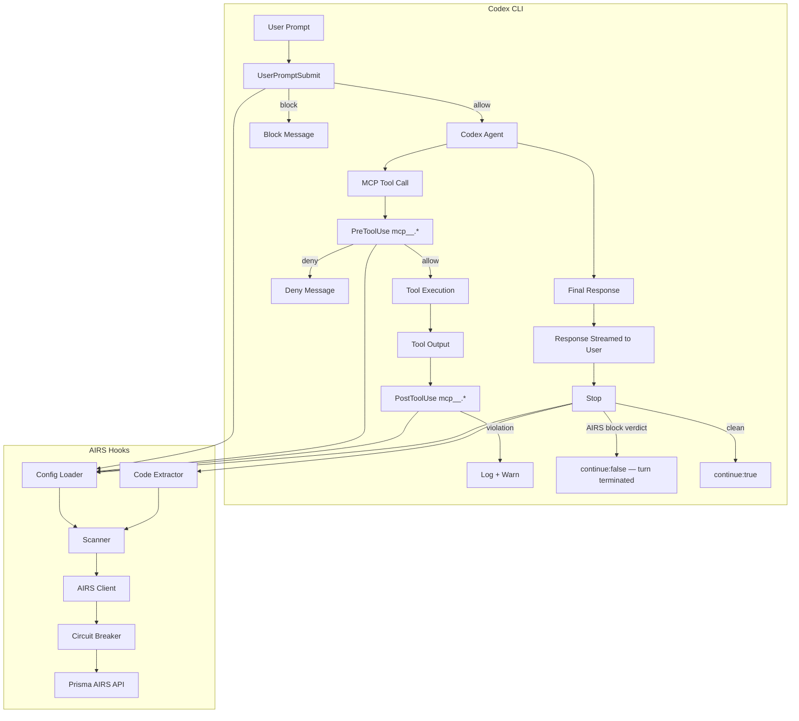

# Architecture Overview

## High-Level Flow

!!! warning "Post-stream response scanning"
    The `Stop` hook fires **after** the response has streamed to the user — Codex has no streaming interception hook. On an AIRS block verdict the hook terminates the turn (`continue: false`), which stops the session from building on flagged content, but the displayed text cannot be retracted. `PostToolUse` is run **observe-only by policy**: Codex can block tool results at this stage, but this project chooses to log and warn instead. See [Codex Hooks API](../reference/codex-hooks-api.md) for details.

!!! info "MCP-only tool scanning"
    Local `Bash` commands and `apply_patch` file edits are **intentionally not scanned** — the `PreToolUse`/`PostToolUse` registrations use the `mcp__.*` matcher so only MCP tool traffic goes to AIRS. See [Design Decisions](design-decisions.md#mcp-only-tool-scanning).

## Module Map

| Module | Purpose |
|--------|---------|
| `src/config.ts` | Load and validate `airs-config.json` with env var resolution and `fail_mode` |
| `src/airs-client.ts` | SDK wrapper with circuit breaker and AIRS correlation IDs |
| `src/scanner.ts` | Scan orchestration, DLP masking, UX block messages, fail-mode handling |
| `src/code-extractor.ts` | Extract code blocks from final responses |
| `src/tool-name-parser.ts` | Parse `mcp__server__tool` format tool names |
| `src/content-limits.ts` | Configurable skip/truncate thresholds before scanning |
| `src/logger.ts` | Structured JSON Lines logging with rotation |
| `src/circuit-breaker.ts` | Failure tracking, cooldown bypass, automatic recovery |
| `src/dlp-masking.ts` | Per-service enforcement actions (block/mask/allow) |
| `src/log-rotation.ts` | Log file rotation at 10MB threshold |
| `src/types.ts` | TypeScript interfaces for config, Codex hook I/O, AIRS |
| `src/hooks-config.ts` | Codex `hooks.json` build/merge/remove for the installer |
| `src/adapters/codex-adapter.ts` | Codex stdout payload builders per hook event |
| `src/hooks/user-prompt-submit.ts` | Codex `UserPromptSubmit` entry point (can block) |
| `src/hooks/pre-tool-use.ts` | Codex `PreToolUse` entry point, MCP-only (can deny) |
| `src/hooks/post-tool-use.ts` | Codex `PostToolUse` entry point, MCP-only (observe-only by policy) |
| `src/hooks/stop.ts` | Codex `Stop` entry point (post-stream; terminates on block verdict) |
| `src/hooks/shared.ts` | stdin reader, normalization, AIRS correlation from Codex IDs |

## Request Lifecycle

### Prompt Scan (UserPromptSubmit — can block)

1. Codex pipes `{ prompt, session_id, turn_id, ... }` as JSON to stdin
2. Hook loads config, initializes logger
3. Scanner sends prompt to AIRS via SDK (`prompt` content key) with `session_id`/`turn_id` correlation
4. Circuit breaker gates the request (bypass if open)
5. AIRS returns verdict + detections
6. If `enforce` mode and verdict is `block`: output `{ "decision": "block", "reason": "..." }`
7. Otherwise: output `{ "continue": true }`

### MCP Tool Scan (PreToolUse — can deny)

1. Codex pipes `{ tool_name, tool_use_id, tool_input, ... }` as JSON to stdin (matcher `mcp__.*`)
2. Non-MCP tool names pass through immediately (defense-in-depth; the matcher already filters)
3. Content limits check: if input exceeds `max_scan_bytes`, skip scan (fail-open)
4. Scanner sends tool input to AIRS via `tool_event` content key using `profiles.tool`
5. AIRS returns verdict + detections
6. If `enforce` mode and verdict is `block`: output `hookSpecificOutput.permissionDecision: "deny"`
7. Otherwise: exit 0 with no output (Codex treats silent exit 0 as allow)

### Tool Output Scan (PostToolUse — observe-only by policy)

1. Codex pipes `{ tool_name, tool_input, tool_response, ... }` as JSON to stdin (**after the tool already executed**)
2. Non-MCP tool names are skipped
3. Content limits applied: truncate or skip oversized content
4. Scanner sends input + response as `tool_event`
5. If violation detected: log to audit trail + emit stderr warning — no blocking output is emitted

### Response Scan (Stop — post-stream)

1. Codex pipes `{ last_assistant_message, stop_hook_active, ... }` as JSON to stdin (**after the response streamed**)
2. If `stop_hook_active` is true the scan is skipped (loop guard)
3. Code extractor splits the message into natural language + code blocks
4. Scanner sends both to AIRS (`response` + `code_response` content keys)
5. `code_response` triggers WildFire/ATP malicious code detection
6. On an AIRS block verdict: output `{ "continue": false, "stopReason": "..." }` — the turn is terminated
7. If clean (or on any error — Stop is always fail-open): output `{ "continue": true }`

## Build & Runtime

Hooks ship as **self-contained minified ESM bundles** (~125KB each, built with esbuild, SDK included). The installer copies them into `.codex/hooks/` so hook execution has no dependency on this repository or `node_modules`:

| Artifact | Command | Notes |
|----------|---------|-------|
| Production | `node .codex/hooks/<hook>.mjs` | Single-file bundle, fast cold start |
| Development | `npx tsx src/hooks/<hook>.ts` | JIT TypeScript, ~1.5s slower per invocation |

See [Contributing](../development/contributing.md) for the development workflow.
