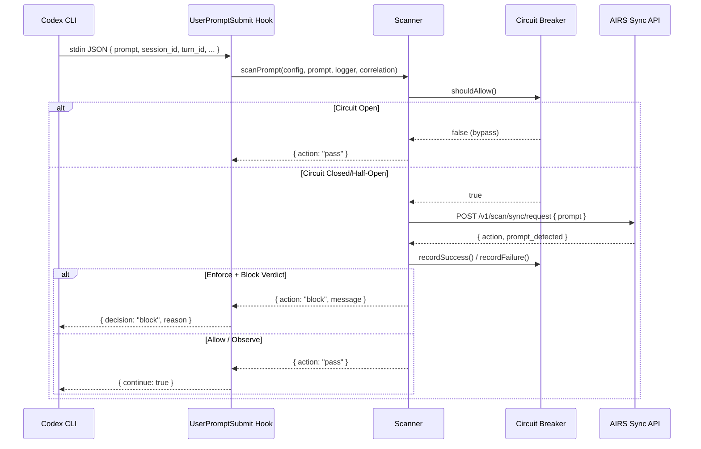
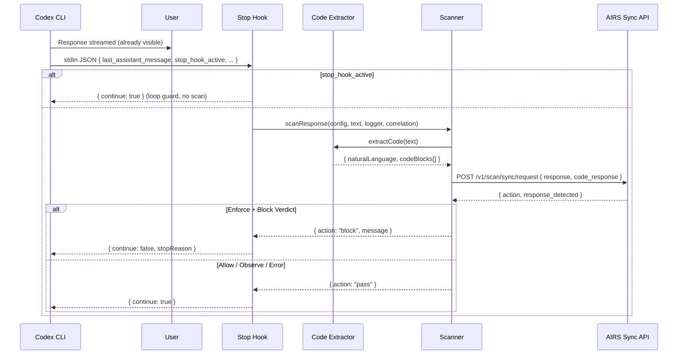
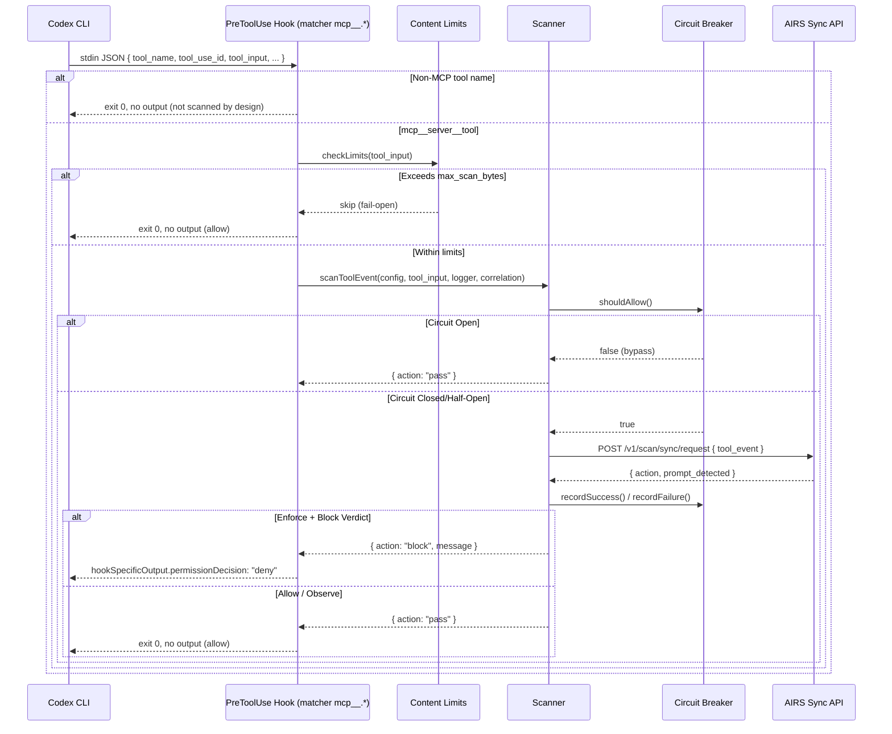
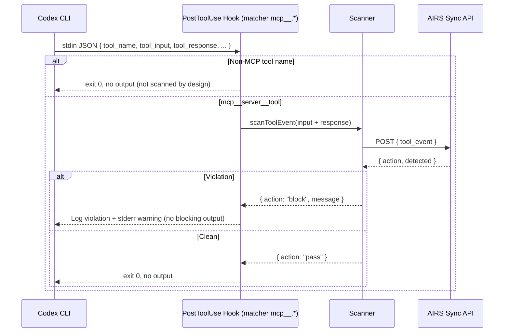

# Scanning Flow

## Prompt Scanning



## Response Scanning (Stop — post-stream)

!!! warning "Post-stream detection"
    The `Stop` hook fires **after** the response streamed to the user — Codex has no streaming interception hook. On an AIRS block verdict the hook returns `continue: false` with a `stopReason`, terminating the turn so the session does not build on flagged content. The displayed text cannot be retracted. The Stop hook is always fail-open: config or API errors never terminate the turn.



## Code Extraction Strategy

The code extractor processes final responses using three strategies in priority order:

1. **Fenced code blocks** -- ` ```language ... ``` ` with language detection
2. **Indented code blocks** -- 4+ leading spaces
3. **Heuristic fallback** -- content matching code indicators (imports, function definitions, braces) above a character threshold

Extracted code is joined with `\n\n---\n\n` separators and sent in the `code_response` field, which triggers WildFire/ATP malicious code scanning on the AIRS side.

## MCP Tool Scanning (PreToolUse — can deny)



## Tool Output Scanning (PostToolUse — observe-only by policy)

!!! warning "Observe-only by policy"
    Codex **can** block tool results in `PostToolUse` (replacing the result with hook feedback), but this project runs the hook observe-only: the completed tool call's side effects can't be undone anyway, so violations are logged and warned for audit. Local Bash output and `apply_patch` edits are not scanned at all — only MCP tools match.



## Content Splitting

| AIRS Field | Content | Detections |
|-----------|---------|------------|
| `prompt` | User's prompt text | Prompt injection, DLP, toxicity, custom topics |
| `response` | Natural language from the final response | DLP, toxicity, URL categorization |
| `code_response` | Extracted code blocks from the final response | Malicious code (WildFire/ATP) |
| `tool_event` | MCP tool inputs and outputs (`metadata.method: "tools/call"`) | Prompt injection, DLP, malicious parameters |

!!! info "Why split content?"
    Sending code separately in `code_response` enables dedicated malicious code detection engines (WildFire, ATP) that don't run on natural language content. This catches things like reverse shells, credential stealers, and obfuscated payloads in generated code. Similarly, `tool_event` is routed to a security profile tuned for tool-call patterns.

## AIRS Correlation

Every scan carries correlation IDs so all activity from one Codex session groups together in AIRS:

| Hook | AIRS `session_id` | AIRS `tr_id` |
|------|-------------------|--------------|
| `UserPromptSubmit` | Codex `session_id` | Codex `turn_id` |
| `PreToolUse` / `PostToolUse` | Codex `session_id` | Codex `turn_id:tool_use_id` |
| `Stop` | Codex `session_id` | Codex `turn_id` |

When Codex omits fields, the transaction ID falls back through `turn_id` → `tool_use_id` → `session_id`, and the AIRS session ID falls back to `app-user:date`.
